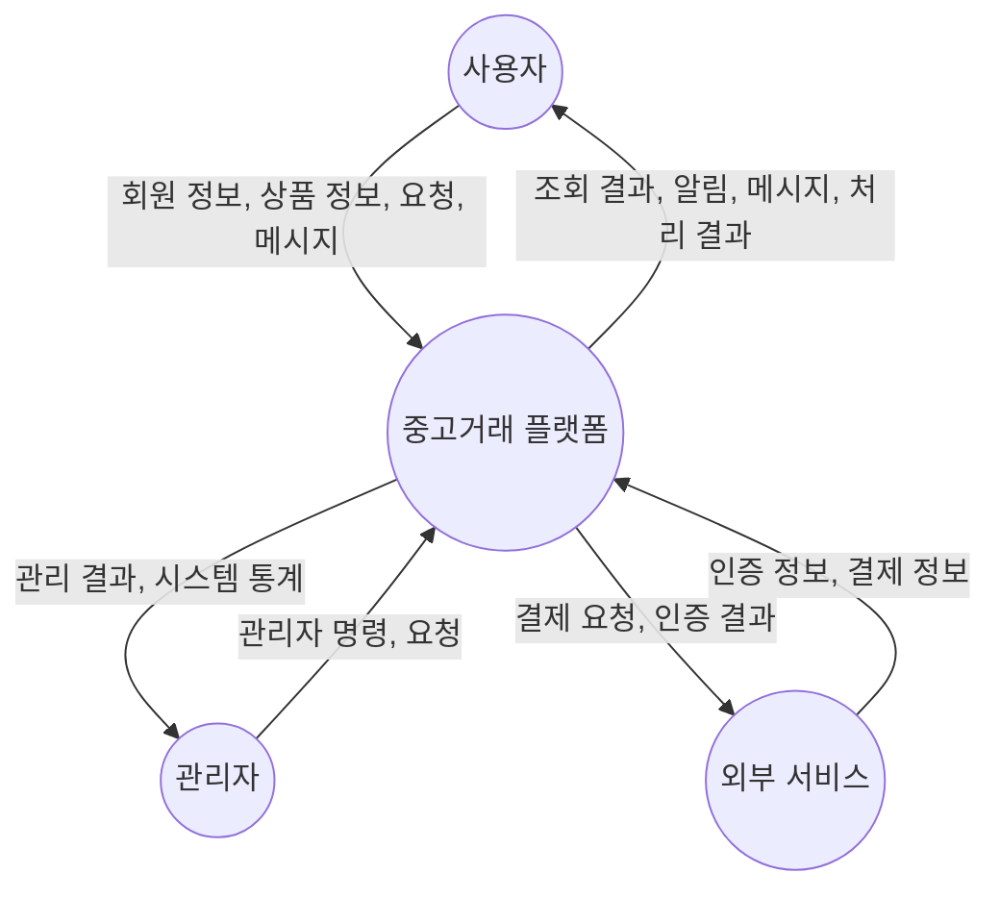

```mermaid
graph TD
    %% 노드 정의 (동그라미 모양, 기본 스타일)
    A((사용자))
    P((중고거래 플랫폼))
    B((관리자))
    C((외부 서비스))

    %% 자료 흐름 정의 (화살표, 라벨)
    A -->|회원 정보, 상품 정보, 요청, 메시지| P;
    P -->|조회 결과, 알림, 메시지, 처리 결과| A;
    B -->|관리자 명령, 요청| P;
    P -->|관리 결과, 시스템 통계| B;
    C -->|인증 정보, 결제 정보| P;
    P -->|결제 요청, 인증 결과| C;
```
